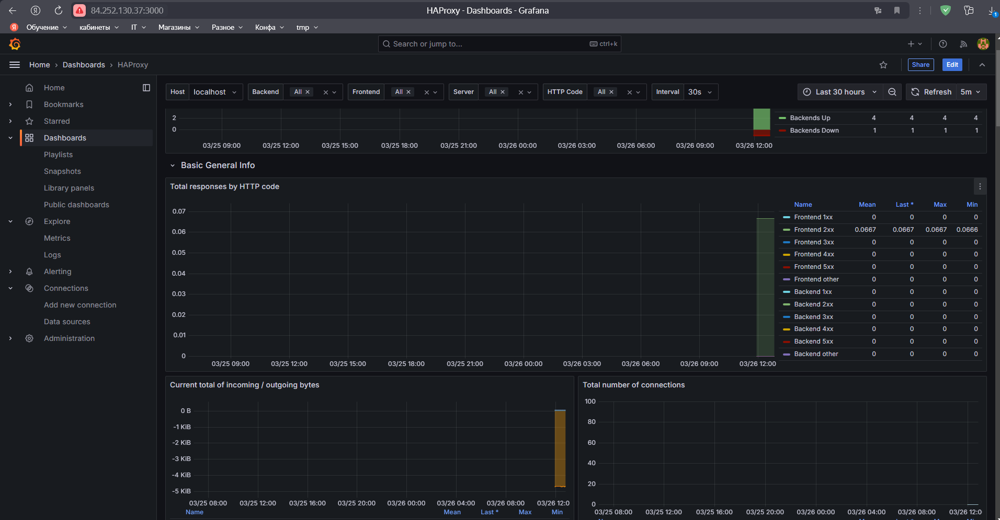
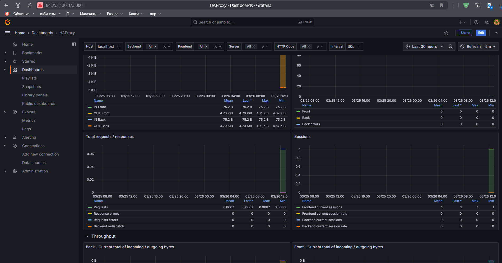
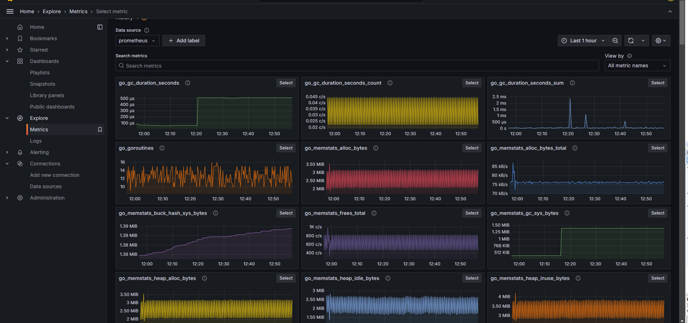

# HAproxy

[Файлы конфигурации](files/)

## haproxy.cfg

```
global
        log /dev/log    local0
        log /dev/log    local1 notice
        chroot /var/lib/haproxy
        stats socket /run/haproxy/admin.sock mode 660 level admin
        stats timeout 30s
        user haproxy
        group haproxy
        daemon

        # Default SSL material locations
        ca-base /etc/ssl/certs
        crt-base /etc/ssl/private

        # See: https://ssl-config.mozilla.org/#server=haproxy&server-version=2.0.3&config=intermediate
        ssl-default-bind-ciphers ECDHE-ECDSA-AES128-GCM-SHA256:ECDHE-RSA-AES128-GCM-SHA256:ECDHE-ECDSA-AES256-GCM-SHA384:ECDHE-RSA-AES256-GCM-SHA384:ECDHE-ECDSA-CHACHA20-POLY1305:ECDHE-RSA-CHACHA20-PO>
        ssl-default-bind-ciphersuites TLS_AES_128_GCM_SHA256:TLS_AES_256_GCM_SHA384:TLS_CHACHA20_POLY1305_SHA256
        ssl-default-bind-options ssl-min-ver TLSv1.2 no-tls-tickets

defaults
        log     global
        mode    http
        option  httplog
        option  dontlognull
        timeout connect 5000
        timeout client  50000
        timeout server  50000
        errorfile 400 /etc/haproxy/errors/400.http
        errorfile 403 /etc/haproxy/errors/403.http
        errorfile 408 /etc/haproxy/errors/408.http
        errorfile 500 /etc/haproxy/errors/500.http
        errorfile 502 /etc/haproxy/errors/502.http
        errorfile 503 /etc/haproxy/errors/503.http
        errorfile 504 /etc/haproxy/errors/504.http
        log-format {\"type\":\ \"haproxy\",\"client_ip\":\ \"%ci\",\"client_port\":\ \"%cp\",\"request_date\":\ \"[%t]\",\"frontend_name\":\ \"%f\",\"backend_name\":\ \"%b\",\"server_name\":\ \"%s\",\>

cache rebrain_cache
       total-max-size 128
       max-object-size 10000
       max-age 30

frontend rebrain_front
       bind *:443 ssl crt /etc/haproxy/rebrain.pem
       mode http
       acl url_api path_beg /api
       acl url_lk path_beg /lk
       option forwardfor
       http-request set-header X-Forwarded-For %[src]
       http-request cache-use rebrain_cache
       http-response cache-store rebrain_cache
       use_backend rebrain_api if url_api
       use_backend rebrain_lk if url_lk
       default_backend rebrain_back

frontend front_sql
       bind *:3307
       mode tcp
       option tcplog
       default_backend rebrain_sql

backend rebrain_api
       mode http
       balance roundrobin
       option prefer-last-server
       cookie REBRAIN insert indirect nocache
       server rebrain_01_80 127.0.0.1:80 cookie rebrain_01_80 check
       server rebrain_02_80 127.0.0.1:80 cookie rebrain_02_80 check

backend rebrain_lk
       mode http
       balance leastconn
       acl is_cached path_end -i .js .php .css
       http-request cache-use rebrain_cache if is_cached
       http-response cache-store rebrain_cache if is_cached
       server rebrain_01_81 127.0.0.1:81 check inter 4s
       server rebrain_02_81 127.0.0.1:81 check inter 4s maxconn 80

backend rebrain_back
       mode http
       balance source
       cookie PHPSESSID prefix
       server rebrain_01_82 127.0.0.1:82 cookie s1 check port 82 inter 8s maxconn 1100
       server rebrain_02_82 127.0.0.1:82 cookie s2 check port 82 inter 8s maxconn 1100
       server rebrain_03_82 127.0.0.1:82 cookie s3 check port 82 inter 8s maxconn 1100

backend rebrain_sql
       mode tcp
       balance roundrobin
       option mysql-check user haproxy
       server rebrain_db_1 127.0.0.1:3306 check port 3306 inter 2s fall 2 rise 1 maxconn 100
       server rebrain_db_2 127.0.0.1:3306 check port 3306 inter 2s fall 2 rise 1 maxconn 100

listen stat
    bind *:777
    mode http
    stats enable
    stats uri /
    stats refresh 30s
    stats show-legends
    stats auth admin:admin
    stats realm "Haproxy Statistics"
    stats hide-version

```
## rsyslog.conf

```
# For more information install rsyslog-doc and see
# /usr/share/doc/rsyslog-doc/html/configuration/index.html
#
# Default logging rules can be found in /etc/rsyslog.d/50-default.conf


#################
#### MODULES ####
#################

module(load="imuxsock") # provides support for local system logging
#module(load="immark")  # provides --MARK-- message capability

# provides UDP syslog reception
module(load="imudp")
input(type="imudp" port="514")

# provides TCP syslog reception
module(load="imtcp")
input(type="imtcp" port="514")

# provides kernel logging support and enable non-kernel klog messages
module(load="imklog" permitnonkernelfacility="on")

###########################
#### GLOBAL DIRECTIVES ####
###########################

# Filter duplicated messages
$RepeatedMsgReduction on

#
# Set the default permissions for all log files.
#
$FileOwner syslog
$FileGroup adm
$FileCreateMode 0640
$DirCreateMode 0755
$Umask 0022
$PrivDropToUser syslog
$PrivDropToGroup syslog

#
# Where to place spool and state files
#
$WorkDirectory /var/spool/rsyslog

#
# Include all config files in /etc/rsyslog.d/
#
$IncludeConfig /etc/rsyslog.d/*.conf

```
## keepalived_master.conf

```
 GNU nano 7.2                                                                         /etc/keepalived/keepalived.conf
global_defs {
    notification_email {
        admin@yourdomain.com
    }
    smtp_connect_timeout 30
    enable_traps
}

vrrp_script chk_haproxy {
    script "killall -0 haproxy"
    interval 2
    weight 2
    fall 2
    rise 2
}

vrrp_instance VI_1 {
    state MASTER
    interface eth0
    virtual_router_id 51
    priority 101
    advert_int 1
    garp_master_delay 10

    authentication {
        auth_type PASS
        auth_pass securepassword123
    }

    unicast_src_ip 84.252.130.37
    unicast_peer {
        62.84.113.123
    }

    virtual_ipaddress {
        84.252.130.37/24 brd 84.252.130.255 scope global label eth0:10
    }

    track_script {
        chk_haproxy
    }
}


```

## keepalived_back.conf

```

global_defs {
    notification_email {
        admin@yourdomain.com
    }
    smtp_connect_timeout 30
    enable_traps
}

vrrp_script chk_haproxy {
    script "killall -0 haproxy"
    interval 2
    weight 2
    fall 2
    rise 2
}

vrrp_instance VI_1 {
    state BACKUP
    interface eth0
    virtual_router_id 51
    priority 100
    advert_int 1
    garp_master_delay 10

    authentication {
        auth_type PASS
        auth_pass securepassword123
    }

    unicast_src_ip 62.84.113.123
    unicast_peer {
        84.252.130.37
    }

    virtual_ipaddress {
        84.252.130.37/24 brd 84.252.130.255 scope global label eth0:10
    }

    track_script {
        chk_haproxy
    }
}


```
## prometheus.yml

```
# my global config
global:
  scrape_interval:     15s # Set the scrape interval to every 15 seconds. Default is every 1 minute.
  evaluation_interval: 15s # Evaluate rules every 15 seconds. The default is every 1 minute.
  # scrape_timeout is set to the global default (10s).

# Alertmanager configuration
alerting:
  alertmanagers:
  - static_configs:
    - targets:
       - localhost:9090

# Load rules once and periodically evaluate them according to the global 'evaluation_interval'.
rule_files:
  # - "first_rules.yml"
  # - "second_rules.yml"

scrape_configs:
  - job_name: 'haproxy'
    static_configs:
    - targets: ['localhost:9091']


```

[Скриншоты](assets/)


Дашборд Grafana



Метрики Grafana

