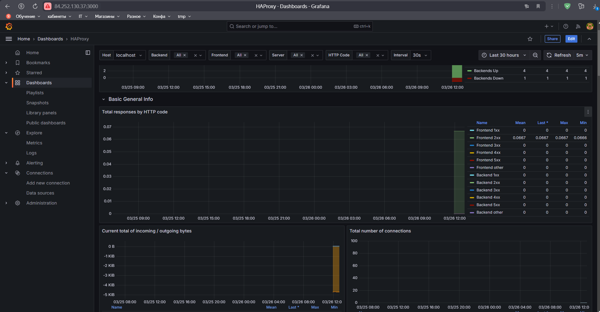
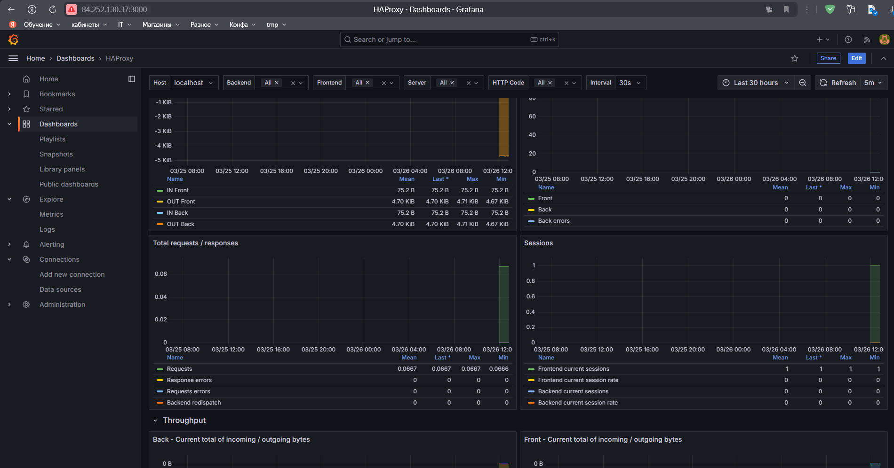
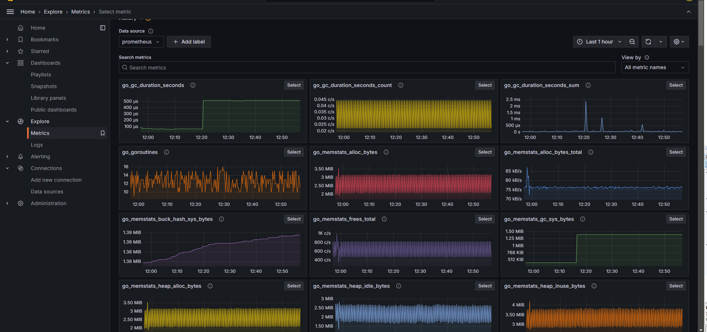

# HAproxy

[Файлы конфигурации](files/)







VMS in YC
```
+----------------------+--------+---------------+---------+----------------+----------------+
|          ID          |  NAME  |    ZONE ID    | STATUS  |  EXTERNAL IP   |  INTERNAL IP   |
+----------------------+--------+---------------+---------+----------------+----------------+
| epdjehfpdpfalutkuep9 | slave2 | ru-central1-b | RUNNING | 158.160.12.225 | 192.168.200.14 |
| fhm2630o4n2btldi565o | slave1 | ru-central1-a | RUNNING | 89.169.143.31  | 192.168.100.20 |
| fv485411t4bqp5mff2dt | master | ru-central1-d | RUNNING | 84.252.135.85  | 192.168.10.100 |
```
[Конфигурация terraform](I.Terraform/)

2. Полученная конфигурация инфраструктуры является предварительной, поэтому в ходе дальнейшего выполнения задания возможны изменения.

---
## Этап второй - Создание Kubernetes кластера

На данном этапе необходимо развернуть `Kubernetes` кластер, для данной задачи будем использовать набор конфигураций _Ansible_ [`Kubespray`](https://github.com/kubernetes-sigs/kubespray)

1. Клонирем `kubespray` командой `git clone https://github.com/kubernetes-sigs/kubespray`
2. Создаем конфигурацию своего кластера:

```shell
cd kubespray
cp inventory/sample inventory/netology
```

3. Выясняем айпи машин кластера на которые будет производится установка:


